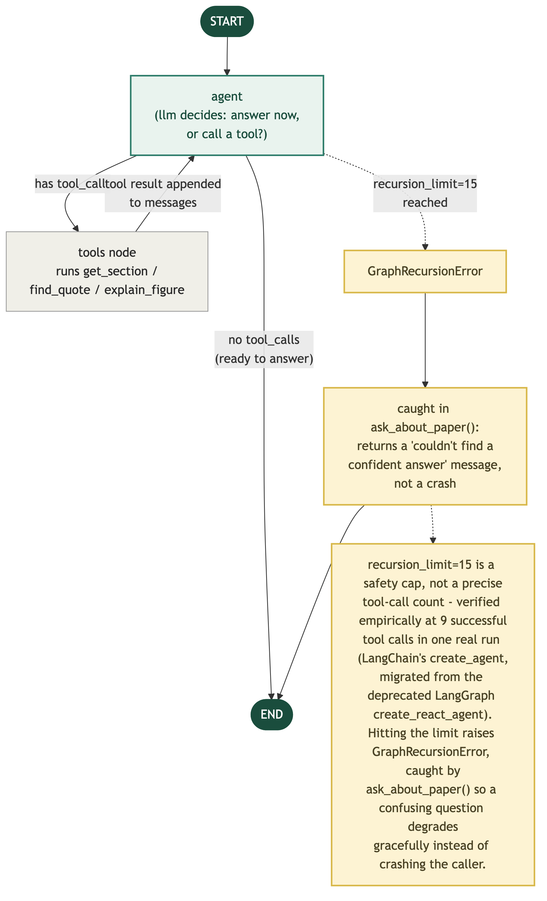
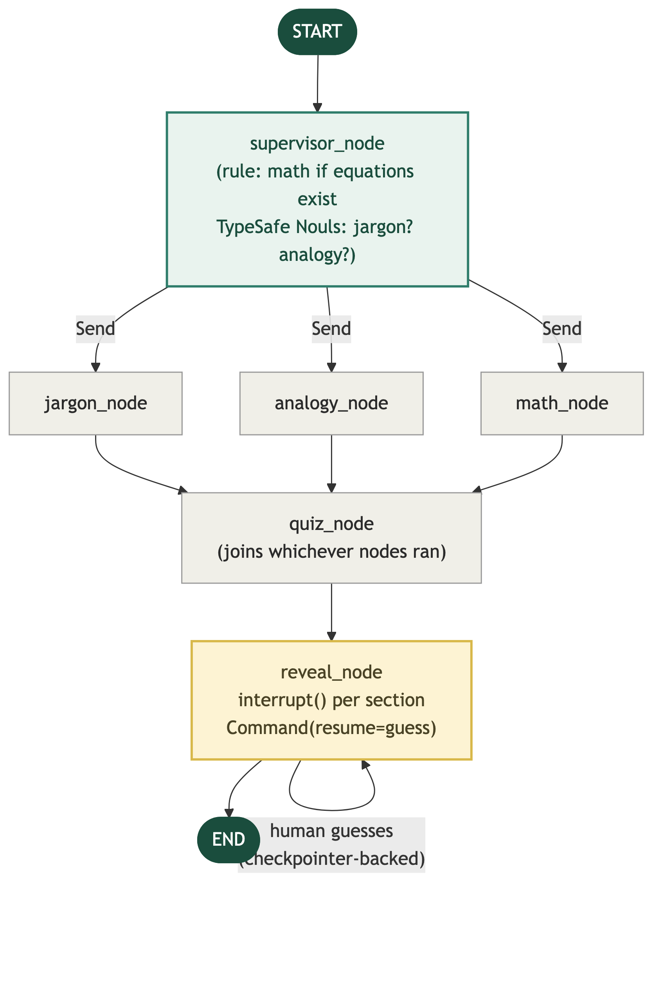

# 📖 Research Paper Reading Assistant

A personal research-paper reading assistant that turns a dense PDF into an interactive study guide — **without doing the reading for you**. Every explanation is grounded in a real citation back to the paper's own text, and nothing is revealed until you've engaged first: a guess, or a quiz.

Built level by level, each one tested against real papers before moving to the next — not a weekend prototype.

## What it does

Three modes:

- **Find Papers** — search arXiv by free-text query (e.g. "latest papers on human-computer interaction"), no upload needed. Results are recency-ranked among genuinely on-topic matches, not just the newest thing that loosely matches a keyword.
- **Ask Questions** — a real ReAct agent that explores an uploaded paper instead of dumping the whole thing into context. It decides for itself whether to jump to a specific section, hunt for the exact supporting sentence, or read a figure — and shows you every tool call it made, not just the final answer.
- **Study Guide** — a supervisor decides, per paper, whether it needs a jargon glossary, an ELI5 analogy, a math walkthrough, or none of the above (a paper with no equations skips the math node entirely — a free rule, not a guess). Each section stays hidden behind a genuine pause in the backend computation until you type your own guess first.

## Why this isn't just a wrapper around an API call

A few decisions worth pointing out, because they're the actual engineering, not the demo:

- **Citations + structured output don't combine.** Verified empirically, not assumed: asking Claude for a Pydantic-typed extraction *and* citations in the same call succeeds without error — but the underlying response is a plain tool-call with no citation data at all, because structured output forces tool-calling, and Claude's citation mechanism only annotates generated text. Fixed with two calls: one for the schema, one separate citations-enabled call that restates the same claims so they get real, verifiable grounding.
- **The gated reveal is a real pause, not a UI trick.** `reveal_node` calls LangGraph's `interrupt()` — the graph itself halts, checkpointed to SQLite. Close the browser mid-quiz and come back a week later with the same thread ID: you resume exactly where you left off, still locked behind whichever section you hadn't guessed yet.
- **TypeSafe (Jev) for judgment, Claude for generation.** Every place this project used to lean on regex or "ask an LLM and hope the reply parses" — classifying PDF blocks as figures vs. equations, matching a fuzzy section name to a real heading, reranking BM25 candidates, routing the supervisor's decisions — now asks a typed `Choice`/`Noul` question instead. Regex still does the cheap, deterministic parts (column-order sorting); TypeSafe only steps in where the decision is actually fuzzy.
- **Real bugs, found by actually running it.** A few examples: batching an entire document's blocks into one TypeSafe call works fine on a short paper and silently exceeds the request limit on a 26-page one (fixed with per-page/per-chunk batching, sized well under the confirmed-safe boundary, not right at the edge of it). `get_section()`'s own `try/except` was quietly swallowing that exact failure and disguising it as "no headings found" — invisible until it was tested directly against a real 628-block paper. Hitting LangGraph's `recursion_limit` raised an uncaught `GraphRecursionError` that crashed the whole agent call until it was caught and turned into a usable fallback. Switching to a reasoning-enabled model silently changed `.content` from a plain string to a list of blocks — invisible until a real call surfaced it, since constructing the model raised no error either way. OpenAI's coding-tuned model wouldn't complete a tool call at all without an explicit `use_responses_api=True` — the default endpoint 400s the moment reasoning and function tools are combined.
- **A package name matching the search isn't evidence it's real.** Before wiring in arXiv search, a PyPI package literally named `langchain-arxiv` turned out to be an unfilled cookiecutter boilerplate template from a single unofficial maintainer — it imported dependencies it never declared and would have crashed on first use. Caught by reading its actual source before installing it for real, not by trusting the name.

## Architecture

**The reading agent (Level 3)** — a genuine iterating ReAct loop, not a fixed pipeline. The model decides after every step whether it has enough to answer or needs another tool call, bounded by a recursion limit with a graceful fallback if a confusing question runs long:



**The study guide swarm (Level 4)** — a supervisor makes one routing decision up front (not a loop), fans out to whichever sections actually apply in parallel, converges into a quiz, then gates the reveal behind a real human-in-the-loop pause:



## Tech stack

| Layer | Choice | Why |
|---|---|---|
| LLM | Claude `claude-sonnet-5` / OpenAI `gpt-6-sol` (`langchain-anthropic`/`langchain-openai`) via LangChain, never a raw SDK | provider-agnostic bring-your-own-key; both are each provider's coding/agentic-tuned tier, not their general flagship, and land at the same price point |
| Agent orchestration | LangChain's `create_agent` (Level 3), LangGraph `StateGraph` (Level 4+) | a real tool-calling loop where it's needed, a fixed parallel-then-converge graph where it isn't |
| Judgment calls | [TypeSafe](https://typesafe.ai) (`langchain-typesafe`) — `Choice`/`Noul` | typed, calibrated decisions instead of regex or parsing free-text LLM replies |
| PDF parsing | PyMuPDF (`fitz`) | text extraction with real column-order correction, figure/equation region cropping |
| Search | `rank_bm25` (in-memory, per paper) → TypeSafe rerank; `arxiv` (external, keyword) | fast keyword retrieval + real judgment for in-paper search; a plain lookup — not routed through an LLM — for finding new papers on arXiv |
| Structured output | Pydantic + Claude's native citations | citation-grounded extraction, verified compatible only as two separate calls |
| Human-in-the-loop | LangGraph `interrupt()` / `Command(resume=...)`, `SqliteSaver` | a real, checkpointed pause — survives closing the app entirely |
| UI | Streamlit | personal, single-user tool — no build step, no auth system to maintain |

## Getting started

```bash
git clone https://github.com/dimitrichakma/research-assistant.git
cd research-assistant
uv sync              # or: pip install -r requirements.txt

# .env
echo 'ANTHROPIC_API_KEY=sk-ant-...' > .env
echo 'TYPESAFE_API_KEY=ts-...' >> .env

streamlit run src/app.py
```

Paste your own Claude (or OpenAI) key in the app itself — nothing is written to disk, it lives only in that session.

## Project structure

```
src/parsing.py       Level 1 — PDF text extraction, column-order correction,
                     figure/equation cropping (TypeSafe-classified, not regex)
src/extract.py       Level 2 — structured, citation-grounded extraction
src/tutor.py         Level 3 — ReAct agent: get_section / find_quote / explain_figure
src/swarm.py         Level 4 — supervisor-gated study guide, real gated reveal
src/arxiv_search.py  Find Papers — arXiv search by keyword, no LLM call
src/app.py           Level 4.5 — Streamlit UI: find papers, chat, study guide, BYOK
docs/                architecture diagrams and design notes
```

## What's next

Growing beyond one paper at a time is a second, independent axis from the level-by-level build above — cross-paper search only gets built once its own trigger is actually hit (a real personal library, keyword search starting to fail, wanting to search by what a figure looked like), not speculatively ahead of it.
